# AirPulse: Software Requirements Specification

**Air Freight Market Intelligence and Benchmark Forecasting Platform**

<!-- srs: version=1.2; date=2026-10-08; status=Released. Published on the owner's decision with one licence point open (section 9.4); reference=Change record CL-027 of the research repository. A hosted repository names the commits it was built from in PUBLIC_REPOSITORY.json -->

| | |
|---|---|
| Version | 1.2 |
| Date | 2026-10-08 |
| Document status | Released. Published on the owner's decision with one licence point open (section 9.4) |
| Repository reference | Change record CL-027 of the research repository. A hosted repository names the commits it was built from in `PUBLIC_REPOSITORY.json` |
| PDF | `docs/SRS.pdf`, built from this file by `python scripts/build_srs.py` |

## 1. Document Control

### 1.1 Purpose

This document specifies AirPulse as it is built: what the system does, the constraints it operates under, the data it uses, how its forecast is defined and validated, and how it is structured and deployed. It is written for a reviewer who must judge the system, for an engineer who takes it over, and for a contributor who needs to know what may and may not be changed.

### 1.2 Scope of the document

The specification covers the production system: the data pipeline, the forecast engine, the forecast ledger, the export, the public web application and the deployment workflow. Research components that exist in the research repository are described only as far as needed to state that they are not part of the product (section 4.3).

The document is descriptive of an existing system. It introduces no requirement that the repository does not implement; where something is planned, absent or unverified, the text says so.

### 1.3 Relation to the other documents

*Table 1. Documentation set.*

| Document | Content |
|---|---|
| `docs/SRS.md` (this document) | Requirements, data, forecasting definition, architecture overview |
| `docs/SYSTEM_DESIGN.md` | Design rationale: decomposition, contracts, patterns, failure handling |
| `docs/REQUIREMENTS_TRACEABILITY.md` | One row per requirement: design component, module, tests, evidence |
| `docs/VERIFICATION_AND_VALIDATION.md` | What was tested, with which result, and what each result does and does not prove |
| `docs/DATA_AND_LICENSING.md` | Every source, its licence status, the retired access path, the deployment gate |
| `docs/OPERATIONS.md` | The production run, failures, recovery, reproduction |
| `docs/USER_GUIDE.md` | The website, page by page, verified in the running application |
| `docs/GITHUB_PUSH_GUIDE.md` | The owner's steps to publish the hosted repository |
| `requirements/SRS.md`, `requirements/requirements.csv` (research repository) | The frozen requirement baseline of 155 requirements, written phase by phase during development. This specification consolidates the requirements of the production system from that baseline and cites its identifiers; the baseline is not replaced |

### 1.4 Conventions

Requirements carry the identifiers FR-nnn (functional) and NFR-nnn (non-functional). "Shall" states a requirement. Four labels are used wherever a statement is not a requirement:

- **Engineering decision**: a choice made in the design, with its reason.
- **Assumption**: something the system relies on and does not verify itself.
- **Research only**: present in the research repository, not part of the product.
- **Not implemented**: stated so that its absence is not mistaken for an oversight.

Sources carry one of four production classes: PRODUCTION, RESEARCH_ONLY, RETIRED, PENDING_CONFIRMATION (section 10).

### 1.5 Revision history

*Table 2. Revision history.*

| Version | Date | Change |
|---|---|---|
| 1.0 | 2026-10-07 | First issue of the consolidated specification, after the licence repair (change record CL-024) and the verification of the production path |
| 1.1 | 2026-10-07 | Diagrams split and enlarged so that no label prints below 7.5 points; sections on constraints, security, licensing controls and failure handling added; user guide verified in the running application; no requirement changed |
| 1.2 | 2026-10-08 | Licence status of the fuel prices: cleared by the owner's decision, without a confirmation of the publisher; sections 2, 9.1, 9.3, 9.4 and 12.13 follow. No requirement changed |

## 2. Executive Summary

AirPulse is a small, fully reproducible system that publishes one thing with a measured record behind it: a monthly outlook for the direction of an official air-freight price index, the U.S. Bureau of Labor Statistics import air freight index for Asia (series IC1312). Around that outlook it shows the public data a reader needs to interpret it.

The product consists of:

- **Official benchmark forecasting.** Once a month, on the day the previous month's index is first published, the system issues probabilities that the index will rise, stay within ±0.5 per cent, or fall. The forecast is written to an append-only ledger before its outcome exists.
- **Historical forecast evaluation.** Every forecast since January 2016 is evaluated by walk-forward validation that uses only what had been published at each forecast date. The record of the official forecaster is 67 correct directions in 122 scored months.
- **Current market observations.** The index by lane as published, for eight series of inbound and outbound U.S. air freight.
- **Fuel intelligence.** Daily U.S. Gulf Coast jet fuel and Brent crude spot prices, as context.
- **Aviation activity.** Observed flights at Hong Kong International Airport, with cargo flights apart, and monthly departures on U.S. international routes.
- **A scenario calculator.** Arithmetic on a rate the visitor enters.
- **Source transparency.** For every source: provider, purpose, publication frequency, age of the data, state of the last retrieval and licence status.

**What AirPulse is not.** It is not a freight quotation engine and it does not forecast a commercial lane rate. An index is a benchmark of price movement across many shipments; it is not the price of a shipment. No validated forecast of a commercial rate at a horizon of days or weeks exists in this system, because no rate history that may lawfully be used without a commercial licence was found (section 5).

**What the evaluation found.** Two machine-learning models were built and evaluated under the same protocol as three simple baselines. Neither model outperformed the seasonal baseline. The official forecaster is therefore the seasonal baseline, selected by a recorded rule; the models remain in the record as comparison forecasters and are not presented as the outlook.

**Status.** The production path is built and verified on fresh clones and is released for publication. One licence point is open and accepted by the owner: the spot prices published by the U.S. Energy Information Administration name a commercial vendor as their source, and the Administration was not asked whether they may be redistributed (section 9.4). The fuel prices are published on the owner's decision and are removed if the publisher or the vendor objects.

## 3. System Scope

### 3.1 In scope

1. Retrieval of the production sources from their publishers on a schedule, with validation before acceptance.
2. A store that reproduces what was known on any past date.
3. A monthly direction forecast of the index IC1312 and of seven secondary index series, with a ledger of issued forecasts and their outcomes.
4. A walk-forward evaluation of five forecasters and the selection of the official forecaster by rule.
5. Export of the data to static files and a public web application that renders them.
6. A deployment workflow with gates for record integrity, tests, export contract, pre-upload checks and licence status.

### 3.2 Out of scope

- A quotation, an estimate or a forecast of the price of a shipment.
- Rates of a commercial lane, in particular South Asia to Europe, which was the original aim of the project (section 5).
- Forecasts at a horizon shorter than the monthly index.
- User accounts, personal data, a server-side application, an application programming interface for third parties.
- Live tracking of flights.

### 3.3 Research-only components

The following are research results and are **not part of the product**: nothing of them is exported or shown on the site, and none of their data is in the hosted repository. Their results were negative or did not meet their pre-registered rule. The hosted repository takes the engine's source whole except the experiment passes, so the code of some of these components is present there without being used for the product; the last column says which.

*Table 3. Research-only components.*

| Component | What it is | Why it is not in the product | Code in the hosted repository |
|---|---|---|---|
| Event layer (`src/news`) | Rule-based reading of trade-press headlines | Parser experimental; its features added no predictive value; the publishers' terms on reuse are unknown | Yes: the operational pipeline imports it. Its two sources are switched off there; no headline, event or output of it is shipped |
| Expansion and global passes (`src/v2`, `src/v3`) | Further data groups and model ladders under protocols 2.0 and 3.0 | No candidate met its promotion rule; the data came through the retired access path | No |
| Weekly fuel-cost outlook | A weekly outlook of fuel cost | Its release windows existed only through the retired access path (section 9.6) | No |
| Air-traffic anomaly reading, capacity proxy, corridor index | Derived readings of the air-traffic data | Did not meet the rule fixed in protocol 4.0 | Yes, as modules of `src/aviation`; their output is excluded from the repository and from the export. The experiment commands (`src/aviation/experiment.py`) are not there |
| European airport activity | Monthly airport statistics | The publisher forbids commercial use | Source switched off; no data shipped |
| Derivatives and positioning study | Protocol 6.0 | Not predictive | No |
| Research dashboard (`src/dashboard`) | A Streamlit tool used during development | Superseded by the web application | Yes: one of its modules is read by the selection of the official forecaster, and the site's Methodology page mentions the tool |

### 3.4 Retired components

The access path through the data services FRED and ALFRED of the Federal Reserve Bank of St. Louis is retired (change record CL-024). The product read its index vintages and its fuel prices through those services until 2026-10-07. Their terms do not permit storing the data or building models on it without the Bank's consent. The same data are now read from the publishers themselves. No adapter, address, identifier or file of that path is in the production code or in the hosted repository, and a deployment check fails if one appears.

### 3.5 Known limitations

1. **The target is a proxy.** IC1312 measures prices of air freight imported into the United States from Asia. How closely it follows rates on other lanes is unknown and is not claimed.
2. **The index is monthly and late.** It is published in the middle of the month for the month before and revised in the three following releases. The outlook is for the month whose value will be published about a month after issuance.
3. **The record is short.** 122 scored months. Differences of a few points between forecasters are within sampling noise; no significance is claimed.
4. **The official forecaster is a calendar rule.** It knows nothing of current events.
5. **Three recent months have no outlook.** The publisher issued no value for October 2025, so neither October nor November 2025 has a monthly change to forecast. January 2026 cannot be issued from the first-party record, because the publisher issued no release table on 2026-02-10 (section 11.6).
6. **No scheduled run has taken place.** The schedule is defined and rehearsed; a first run on the hosting provider may reveal what a rehearsal cannot.
7. **AirPulse does not provide a live commercial shipment quote.**

## 4. Problem Statement

Air-freight pricing is difficult to observe from outside the trade. Rates are agreed between carriers, forwarders and shippers; they vary by lane, weight break, commodity and week; and the series that summarise them are compiled by commercial providers and sold under licence. The public alternatives are few: official price indexes, published monthly and revised; carriers' fuel surcharges, which are a component of a price and not a price; and official trade statistics, which arrive weeks late.

The project began with the aim of forecasting air-freight rates from South Asia to Europe. A data audit established that no public historical price series for that lane could be obtained. A later feasibility study and a final audit of twenty candidate sources (change records CL-021 and CL-023) reached the same conclusion for any current commercial rate: every source that publishes current prices either licenses them commercially or forbids automated collection and modelling in its terms.

Two responses were possible. One was to construct a rate from proxies and present a forecast of it. The other was to forecast something that is published, dated and revisable by rule, and to say exactly what it is. AirPulse does the second.

**Engineering decision.** The target is an official index, chosen because every value of it carries a publication date, so that a forecast can be shown to have used only information available when it was made. A forecast of a constructed rate could not have been validated against anything.

## 5. Objectives

*Table 4. Objectives.*

| Class | Objective |
|---|---|
| Technical | Retrieve, validate and store the production sources unattended; never replace valid data with invalid data; keep a record of every attempt |
| Technical | Publish the product as static files, with no server and no credential |
| Scientific | Evaluate every forecaster on information available at each forecast date only, with revisions of the index handled explicitly |
| Scientific | Report negative results as they are; show as the outlook only what the evaluation supports |
| Product | Give a reader the benchmark outlook, its record and the surrounding public data, each with its source and date; never present an index as a quote |
| Reproducibility | Regenerate every stored result from the files held by documented commands; give identical results on repeated runs |
| Operational | Complete every run with a record and an exit code whatever a source does; publish nothing after a failed check or while a licence is unresolved |

## 6. Actors

The system has six actors. No organisation, team or client is involved; the maintainer is the owner of the repository.

*Table 5. Actors.*

| Actor | Kind | Role |
|---|---|---|
| Public User | Human | Reads the site: index, outlook, record, fuel, air traffic, method, sources; uses the scenario calculator |
| Data Source | External system | A publisher's website or data interface, read over HTTPS; never written to |
| Production Scheduler | External system | Starts a run on three schedules or by hand (GitHub Actions) |
| Forecast Engine and Production Pipeline | The system | Ingests, validates, forecasts, records, exports |
| Repository and Deployment System | External system | Holds the code and the operational state; hosts the static site (GitHub, GitHub Pages) |
| Maintainer / Operator | Human | Maintains source declarations and licence status; starts a run by hand; rebuilds and verifies the benchmark |

Figure 1 shows the use cases of each actor. Only use cases that the system implements are drawn.


*Figure 1. Use case diagram. Dashed arrows are «include» relations: a production run always includes fetching, issuing and exporting; an export always includes the deployment gate.*

## 7. Functional Requirements

Each requirement is given with its inputs, processing, outputs, acceptance criteria and traceability. Priorities: *Essential* (the product does not function without it), *Conditional* (enhances the product), *Optional*. The full traceability, with validation evidence, is in `docs/REQUIREMENTS_TRACEABILITY.md`.

#### FR-001 Source declaration and registry

| Field | Specification |
|---|---|
| Description | Every external source shall be declared once, with its address, publication frequency, check interval, staleness limits and licence status, and the system shall compute a registry of the state of every source from those declarations and the run records. |
| Priority | Essential |
| Inputs | `config/sources.yaml`, `config/production_sources.yaml`, the ingestion log. |
| Processing | Declarations are read without state; status is derived from the newest attempts and the clock. |
| Outputs | `operations/sources.yaml` (generated registry); the source table of the site. |
| Acceptance criteria | A source that is not declared cannot be fetched; the registry is reproduced byte for byte from the same records and the same clock. |
| Traceability | Baseline: REQ-PROD-001, REQ-PUB-001. Modules: `src/observability/sources.py`, `registry.py`. Tests: PR-T01, PR-T04. |

#### FR-002 Publication-aware scheduling of sources

| Field | Specification |
|---|---|
| Description | A run shall ask a source only when it is due: never fetched, check interval reached, new data expected from the publisher, or the last attempt failed. |
| Priority | Essential |
| Inputs | The registry; the time of the run; an optional list of forced groups. |
| Processing | For every source the reason for being due is computed; sources that are not due are skipped. |
| Outputs | The plan of the run (groups and sources with reasons), recorded in the run record. |
| Acceptance criteria | With unchanged records and no interval elapsed a run fetches nothing; a failed source is retried once in the next run. |
| Traceability | Baseline: REQ-PROD-008. Modules: `scripts/production_run.py` (`due`). Tests: PR-T14. |

#### FR-003 Source ingestion through adapters

| Field | Specification |
|---|---|
| Description | The system shall retrieve each production source through an adapter specific to its publisher: the archived releases and the public data interface of the Bureau of Labor Statistics, the history spreadsheets of the Energy Information Administration, the flight information of Hong Kong airport and the route file of the U.S. Department of Transportation. |
| Priority | Essential |
| Inputs | The address of the source; the file currently held. |
| Processing | Bounded requests with fixed pauses and an identified client; only releases newer than the newest one held are read. |
| Outputs | A candidate file; a dated raw copy of the publisher's answer; one ingestion record. |
| Acceptance criteria | Each adapter passes its tests against recorded answers without the network; no adapter makes more than three requests per address. |
| Traceability | Baseline: REQ-OPS-001, REQ-OPS-004, REQ-OPS-005, REQ-PROD-004. Modules: `src/ops/adapters.py`, `bls.py`, `eia.py`; `src/aviation/collector.py`. Tests: OP-T2, OP-T3, OP-T4, LR-T01, PR-T07. |

#### FR-004 Validation before acceptance

| Field | Specification |
|---|---|
| Description | A retrieved answer shall replace the file held only after it has been parsed and has passed the validation of its source; a rejected answer shall change nothing. |
| Priority | Essential |
| Inputs | The candidate file; the file held; the checks of the source (structure, identifiers, dates, value ranges, continuity with the columns already held). |
| Processing | The candidate is parsed by the same loader the engine uses; stored columns must be unchanged by a merge. |
| Outputs | Accepted: the current file and its checksum sidecar are replaced. Rejected: a record with the reason. |
| Acceptance criteria | An empty, truncated, corrupt or future-dated answer leaves every data file and every forecast unchanged. |
| Traceability | Baseline: REQ-OPS-002, REQ-PROD-003, REQ-DATA-006. Modules: `src/ops/adapters.py`, `src/ingestion/loaders.py`. Tests: PR-T05, PR-T08, T01 (checksum). |

#### FR-005 Idempotent ingestion

| Field | Specification |
|---|---|
| Description | A run on source content that is already held shall write no data file and shall record the result as UNCHANGED. |
| Priority | Essential |
| Inputs | The candidate file and the checksum of the file held. |
| Processing | Comparison of content; no write when equal. |
| Outputs | An ingestion record with result UNCHANGED. |
| Acceptance criteria | A second run on unchanged sources changes no data file, issues no forecast and gives the same content hash of the export. |
| Traceability | Baseline: REQ-OPS-003. Modules: `src/ops/adapters.py`. Tests: OP-T2. |

#### FR-006 Preservation of raw data and provenance

| Field | Specification |
|---|---|
| Description | The system shall keep, for every accepted file, a checksum sidecar with source, address and retrieval time, and shall keep the publisher's answers as dated raw copies. |
| Priority | Essential |
| Inputs | The accepted file and the raw answer. |
| Processing | SHA-256 of the file; sidecar written with it; raw copy stored under the date of retrieval. |
| Outputs | `*.meta.json` sidecars; `operations/raw/`; the table `source_files` of the store. |
| Acceptance criteria | A file whose bytes differ from its sidecar is refused at load; every forecast record names its input files with their checksums. |
| Traceability | Baseline: REQ-DATA-003, REQ-DATA-006, REQ-PROD-007. Modules: `src/ingestion/loaders.py`, `src/ops/adapters.py`. Tests: T01, T13, PR-T13. |

#### FR-007 Normalisation into the canonical store

| Field | Specification |
|---|---|
| Description | The system shall load every release of the eight index series and the two daily fuel series into one store that returns, for any series and any date, each value as it was available on that date. |
| Priority | Essential |
| Inputs | The current files (one column per release for the indexes; date and value for fuel). |
| Processing | Each value is written once per date on which it first appeared or changed (a revision log). |
| Outputs | The derived SQLite store (`observations`, `vintages`, `releases`). |
| Acceptance criteria | Values read back equal the files; a known revision is returned differently before and after its release date. |
| Traceability | Baseline: REQ-DATA-001 to REQ-DATA-004, REQ-DATA-007. Modules: `src/ingestion/build.py`, `src/database/store.py`, `schema.sql`. Tests: T01, T02, T06 (fuel rule). |

#### FR-008 Vintage handling

| Field | Specification |
|---|---|
| Description | The system shall hold the index history as one column per release of the publisher, shall never alter a stored column, and shall place no value in a column that was published after that release. |
| Priority | Essential |
| Inputs | The archived release tables of the Bureau; its database values; the matrix held. |
| Processing | The reconstruction rule of change record CL-024: printed values as printed; the unprinted second revision inferred from the printed changes; older months final. |
| Outputs | The vintage matrix of each series; a log of the rule applied to every cell. |
| Acceptance criteria | The benchmark files are rebuilt byte for byte from the kept release tables; no cell of a column postdates its release. |
| Traceability | Baseline: REQ-ML-001, REQ-OPS-005. Modules: `src/ops/bls.py`, `scripts/build_bls_vintages.py`, `src/preprocessing/labels.py`. Tests: LR-T01 to LR-T05, T04, OP-T4. |

#### FR-009 Data quality and freshness status

| Field | Specification |
|---|---|
| Description | The system shall record quality figures of every series and shall report every source as HEALTHY, DEGRADED, STALE, FAILED, DISABLED or RESEARCH_ONLY from the records and the clock alone. |
| Priority | Essential |
| Inputs | The store; the ingestion log; the staleness limits of the declarations. |
| Processing | Counts of duplicates and gaps; age of the newest attempt and of the newest data against the limits. |
| Outputs | `data_quality_results`; the registry; the data-state view of the site. |
| Acceptance criteria | No source is called automated unless a scheduler started its newest successful fetch; a source beyond its limit is shown as stale. |
| Traceability | Baseline: REQ-DATA-005, REQ-OPS-009, REQ-PROD-002. Modules: `src/validation`, `src/observability/registry.py`. Tests: T03, PR-T02, PR-T03, OP-T7. |

#### FR-010 Label construction

| Field | Specification |
|---|---|
| Description | The system shall compute, for every month of every series, the direction of the monthly change as UP, FLAT or DOWN with a flat band of 0.5 per cent, once from the first-released values and once from the final values, with the date on which each became known. |
| Priority | Essential |
| Inputs | The store; the release calendar. |
| Processing | Percent change from the previous month; comparison with the band; a month without a published value has no label. |
| Outputs | The table `labels` (kinds REALTIME and FINAL). |
| Acceptance criteria | Labels of a constructed case equal the rule; no label is imputed; a month has an issuance date only if the previous month was on record earlier. |
| Traceability | Baseline: REQ-ML-002 to REQ-ML-004. Modules: `src/preprocessing/labels.py`. Tests: T05, LR-T06. |

#### FR-011 Feature construction as of issuance

| Field | Specification |
|---|---|
| Description | The system shall compute every feature of a target month only from values whose availability date is not later than the issuance date of that month. |
| Priority | Essential |
| Inputs | The store queried as of the issuance date. |
| Processing | Changes of the series itself, of its peer series and of the fuel prices (available eight days after their date), and the month of the year. |
| Outputs | One feature row per series and target month, with the latest information time used. |
| Acceptance criteria | Removing every observation published after issuance changes no feature; the latest information time never exceeds the issuance time. |
| Traceability | Baseline: REQ-ML-005, REQ-DATA-007. Modules: `src/features/build.py`. Tests: T06. |

#### FR-012 Forecast generation

| Field | Specification |
|---|---|
| Description | The system shall produce, for each target month, class probabilities for DOWN, FLAT and UP from three baselines (majority class, persistence, same calendar month) and two fitted models (multinomial logistic regression, shallow gradient-boosted trees), every parameter fitted inside the training window. |
| Priority | Essential |
| Inputs | Feature rows and labels known at issuance. |
| Processing | Baselines by counting with add-one smoothing; models fitted with a fixed seed. |
| Outputs | Three probabilities and the predicted class per forecaster. |
| Acceptance criteria | Baselines equal a hand-computed case; models return probabilities that sum to one and are identical under the same seed. |
| Traceability | Baseline: REQ-ML-007, REQ-ML-008, REQ-ML-010. Modules: `src/forecasting/baselines.py`, `models.py`. Tests: T07, T08. |

#### FR-013 Walk-forward evaluation and metrics

| Field | Specification |
|---|---|
| Description | The system shall evaluate every forecaster by expanding-window walk-forward validation from January 2016, one forecast per month and series, on identical months, and shall report hit rate, balanced hit rate, macro F-score, Brier score and log loss. |
| Priority | Essential |
| Inputs | The store; the frozen configuration. |
| Processing | At each origin the model is fitted only on labels known at issuance; forecasts are scored when the final value is known. |
| Outputs | `evaluation/forecast_ledger.csv`, the result tables, the experiment register. |
| Acceptance criteria | Every reported metric is recomputed from the ledger and equals the stored value; the five forecasters are scored on the same months. |
| Traceability | Baseline: REQ-ML-006, REQ-ML-009, REQ-ML-011 to REQ-ML-014. Modules: `src/api/backtest.py`, `src/evaluation/metrics.py`. Tests: T09, T10, T11. |

#### FR-014 Selection of the official forecaster by rule

| Field | Specification |
|---|---|
| Description | The forecaster shown as the outlook shall be the one that the evaluation of the validated series singles out among validated forecasters by both probability score and hit rate; if the criteria disagree, nothing shall be shown as official. |
| Priority | Essential |
| Inputs | The evaluation results of the validated series; the stored decisions of later experiments held in the repository. |
| Processing | The rule is applied on every run; nothing in the code names a forecaster. |
| Outputs | `operations/official_forecast.json`. |
| Acceptance criteria | The record equals a recomputation from the scores; a disagreement of the criteria raises an error instead of a choice. |
| Traceability | Baseline: REQ-PROD-006. Modules: `src/ops/selection.py`. Tests: PR-T12. |

#### FR-015 Operational forecast issuance

| Field | Specification |
|---|---|
| Description | The system shall issue the forecast of the newest target month once per series and forecaster, from data published by its issuance date, and the forecast shall equal what the evaluation gives for the same inputs. |
| Priority | Essential |
| Inputs | The store rebuilt from the current files; the selection record. |
| Processing | The months due are determined from the release calendar; a forecast already on the ledger is not issued again. |
| Outputs | New entries of the forecast ledger. |
| Acceptance criteria | A second run issues nothing; an observation published later changes no forecast issued before it. |
| Traceability | Baseline: REQ-OPS-006, REQ-OPS-007, REQ-PROD-007. Modules: `src/ops/pipeline.py`. Tests: OP-T5, PB-T07. |

#### FR-016 Forecast ledger

| Field | Specification |
|---|---|
| Description | Every issued forecast shall be recorded in an append-only, hash-chained ledger with its identifier, issuance date, data cut-off, probabilities, predicted class, forecaster and parameters, the version of its input files and of the code. |
| Priority | Essential |
| Inputs | The forecast and its provenance. |
| Processing | Each entry carries the hash of the previous entry; verification recomputes the chain. |
| Outputs | `operations/forecast_ledger.jsonl`. |
| Acceptance criteria | Altering, removing or reordering an entry is detected; the production gate fails on a broken chain. |
| Traceability | Baseline: REQ-FN-001, REQ-FN-002, REQ-OPS-006. Modules: `src/observability/records.py`, `src/ops/pipeline.py`. Tests: OP-T1, OP-T6, PR-T13. |

#### FR-017 Outcome recording and historical forecast record

| Field | Specification |
|---|---|
| Description | The system shall record the first-published and the final outcome of every issued forecast once each becomes known, without changing the forecast, and shall present the record of all scored forecasts. |
| Priority | Essential |
| Inputs | The ledger; newly published values. |
| Processing | An outcome is appended as its own entry; the ledger entry is never rewritten. |
| Outputs | `operations/forecast_outcomes.jsonl`; the history and reliability figures of the site. |
| Acceptance criteria | An earlier forecast is byte-identical after its outcome is added; the reliability figures of the site are counted from the published ledger. |
| Traceability | Baseline: REQ-OPS-008, REQ-FN-005. Modules: `src/ops/pipeline.py`; `airpulse-web/scripts/export_data.py`. Tests: OP-T6; application tests (production). |

#### FR-018 Replay of a past forecast

| Field | Specification |
|---|---|
| Description | For a series and a target month the system shall show the issuance date, the inputs that were available then, the forecast issued and the outcome, and shall recompute the stored forecast exactly. |
| Priority | Conditional |
| Inputs | The store; the ledger. |
| Processing | The forecast is recomputed as of its issuance date. |
| Outputs | The replay data of the site; the `replay` command. |
| Acceptance criteria | The recomputed forecast equals the ledger; no input published after issuance is shown as available. |
| Traceability | Baseline: REQ-FN-003, REQ-REPLAY-001, REQ-REPLAY-002. Modules: `src/api/backtest.py`, `src/cli.py`; `airpulse-web/src/pages/Replay.jsx`. Tests: T12, DB-T3. |

#### FR-019 Failure handling

| Field | Specification |
|---|---|
| Description | A source that is unavailable, late, rate limited or invalid shall leave the data held and the forecasts unchanged, shall be recorded with its reason, and shall not stop the other sources or steps of the run. |
| Priority | Essential |
| Inputs | The failed attempt. |
| Processing | Each layer runs as its own process with a time limit; the failure is recorded and the run continues. |
| Outputs | An ingestion record with result FAILED; exit code 2 of the run; the state shown on the site. |
| Acceptance criteria | With every source unreachable the run completes, no data file changes, no forecast is issued and the site names the sources as not healthy. |
| Traceability | Baseline: REQ-PROD-003, REQ-OPS-002. Modules: `scripts/production_run.py`, `src/ops/adapters.py`. Tests: PR-T05, PR-T06, PR-T15, OP-T8. |

#### FR-020 Run record and production gate

| Field | Specification |
|---|---|
| Description | Every run shall append one record of what was asked, what answered and what failed, and shall pass a gate (record chains intact, declarations and policy consistent, official forecaster singled out) before anything is committed, exported or built. |
| Priority | Essential |
| Inputs | The records written by the run. |
| Processing | Verification of the chains and of the consistency checks; exit code 1 on failure. |
| Outputs | `operations/production_runs.jsonl`; the exit code. |
| Acceptance criteria | After one altered character in the ledger the gate stops the job and nothing is committed, exported, built or uploaded. |
| Traceability | Baseline: REQ-PUB-004, REQ-HOST-003. Modules: `scripts/production_run.py`, `src/observability/records.py`. Tests: PB-T05, DP-T03. |

#### FR-021 Source transparency and feature gate

| Field | Specification |
|---|---|
| Description | A feature shall be part of the public product only while the production policy classes it as PRODUCTION READY and every one of its sources may be used, and the site shall show for every source its provider, purpose, frequency, state and licence status. |
| Priority | Essential |
| Inputs | `config/production_sources.yaml`. |
| Processing | Policy checks on every run; features that are not ready are listed with the reason. |
| Outputs | The Data and Methodology pages; the list of features not offered. |
| Acceptance criteria | A source with an unknown or restricted licence class is refused whatever else is set; a removed feature has no field in the exported data. |
| Traceability | Baseline: REQ-PUB-001, REQ-PUB-002. Modules: `src/observability/policy.py`. Tests: PB-T01, PB-T02, PB-T03, LR-T07. |

#### FR-022 Production export under a data contract

| Field | Specification |
|---|---|
| Description | The data the site reads shall be generated by one export that writes to a staging folder, checks the contract of every file, refuses any field of a removed feature and publishes the files together. |
| Priority | Essential |
| Inputs | The operational state; the evaluation ledger; the policy. |
| Processing | Staged write, contract checks, content hash, atomic publication. |
| Outputs | `airpulse-web/public/data/*.json` with a content hash. |
| Acceptance criteria | The same state gives the same content hash; a contract violation publishes nothing. |
| Traceability | Baseline: REQ-PROD-011, REQ-HOST-005. Modules: `airpulse-web/scripts/export_data.py`, `guards.py`. Tests: Application tests (data-contract, production, expansion); DP-T08. |

#### FR-023 Website rendering

| Field | Specification |
|---|---|
| Description | The public site shall present the index by lane, the monthly benchmark outlook with its record, fuel prices, the observed airport and route activity, the method and the state of every source, from the exported files alone, under the path of the repository and on a reload of any route. |
| Priority | Essential |
| Inputs | The exported data files. |
| Processing | A static single-page application; no request to any other service. |
| Outputs | The pages listed in `docs/USER_GUIDE.md`. |
| Acceptance criteria | The built site is served correctly by a static server that behaves like the host; every route answers a reload; no value is typed into a page. |
| Traceability | Baseline: REQ-HOST-006. Modules: `airpulse-web/src`. Tests: Application tests (47); DP-T09. |

#### FR-024 Scenario calculator

| Field | Specification |
|---|---|
| Description | The site shall compute the cost of a shipment scenario from a rate, a weight and percentage changes that the user enters; it shall not supply a rate. |
| Priority | Optional |
| Inputs | Values typed by the user. |
| Processing | Arithmetic in the browser; strict reading of the typed amounts. |
| Outputs | The scenario result on the Estimate page. |
| Acceptance criteria | No rate is pre-filled or estimated; malformed input gives no result. |
| Traceability | Baseline: Policy feature `scenario_calculator` (no baseline requirement). Modules: `airpulse-web/src/pages/Estimate.jsx`, `src/lib`. Tests: Application tests (scenario). |

#### FR-025 Deployment gating

| Field | Specification |
|---|---|
| Description | Nothing shall be uploaded or deployed after a failed gate, a failed test, a refused export, a finding of the pre-upload checks, or while a production source has a licence status other than CLEARED. |
| Priority | Essential |
| Inputs | The results of the steps of the workflow; the production policy. |
| Processing | Each step runs only if all before it passed; the licence gate sets the condition of the upload step and of the deploy job. |
| Outputs | A deployed site, or a built and checked site that is not uploaded and a failed licence job. |
| Acceptance criteria | With a source pending, the rehearsal shows the upload step and the deploy job skipped and the licence job failed. |
| Traceability | Baseline: REQ-HOST-002, REQ-HOST-003, REQ-HOST-005. Modules: `scripts/deployment_checks.py`, `.github/workflows/production.yml`. Tests: DP-T02, DP-T03, DP-T08, LR-T08. |

#### FR-026 Reproduction from the files held

| Field | Specification |
|---|---|
| Description | From the input files alone the system shall regenerate the store, the evaluation ledger and the values that follow from them by documented commands. |
| Priority | Essential |
| Inputs | The benchmark snapshot; the kept release tables and spreadsheets. |
| Processing | `build-db`, `backtest`, `scripts/build_bls_vintages.py build`. |
| Outputs | The store; `evaluation/forecast_ledger.csv` with its pinned checksum. |
| Acceptance criteria | Two runs give the same ledger byte for byte on one platform; on another platform the ledger is numerically equivalent within justified tolerances. |
| Traceability | Baseline: REQ-REP-001, REQ-REP-003, REQ-FN-004, REQ-PUB-005. Modules: `src/cli.py`, `scripts/check_benchmark_ledger.py`. Tests: T15, T19 to T22, PB-T06, LR-T05. |

## 8. Non-Functional Requirements

*Table 6. Non-functional requirements.*

| ID | Quality | Requirement | Measure and acceptance | Status |
|---|---|---|---|---|
| NFR-001 | Correctness of information timing | No forecast shall use information published after its issuance. | For every forecast on the ledger: latest feature information time <= issuance time < target time. | Verified |
| NFR-002 | Reproducibility | The recorded results shall be reproducible from the repository by documented commands with pinned dependencies. | A fresh clone rebuilds the ledger of record; exact versions in `requirements.txt`. | Verified |
| NFR-003 | Determinism | The evaluation shall give an identical ledger file when run twice on the same inputs. | Equal SHA-256 on the development platform; numerical equivalence within 1e-10 and 1e-14 on Linux. | Verified |
| NFR-004 | Maintainability | Constants of the method shall be defined in one place, and no package shall import a package of a later layer. | One configuration module; the phase-boundary validator passes. | Verified |
| NFR-005 | Portability | The engine shall run on Windows and on Linux with the same pinned dependencies. | All workflows pass on a fresh Linux clone; the ledger there is numerically equivalent. | Verified |
| NFR-006 | Reliability of the unattended run | A run shall always complete with a record and an exit code, whatever a source or a step does. | A step that fails or exceeds its time limit is recorded and the others continue. | Verified |
| NFR-007 | Data integrity | Stored files shall be protected by checksums and operational records by hash chains. | A file that differs from its sidecar is refused; a broken chain fails the gate. | Verified |
| NFR-008 | Security | The system shall need no credential, shall store none, and shall give the repository write token of the workflow to one step only. | No secret in any workflow; the pre-upload checks search every file for secrets. | Verified |
| NFR-009 | Privacy | The site shall collect no personal data: no account, no cookie, no analytics, no request to a third party. | The application requests only its own static files. | Verified by inspection and scan |
| NFR-010 | Licensing compliance | Every source shall carry one licence status with its evidence, and nothing of a source that is not cleared for production shall be published. | Policy consistent; hosted folder free of the retired access path; licence gate closed while a source is pending. | Verified; one confirmation open (EIA) |
| NFR-011 | Performance | The evaluation of all eight series shall complete within 30 minutes; the site shall need no server computation. | Measured about two minutes on the development machine; the site is static files. | Verified |
| NFR-012 | Accessibility | Pages shall use semantic headings and labelled regions, and shall respect a reduced-motion preference. | Labelled sections and controls in the page sources. | Implemented; not independently audited |
| NFR-013 | Responsive user interface | Pages shall remain usable on narrow screens. | Breakpoints in every style sheet. | Implemented; not systematically tested |
| NFR-014 | Observability | Every run, every attempt on a source and every forecast shall leave a record from which the state of the system can be reported without the code that produced it. | The operations report and the registry are written from the records alone. | Verified |
| NFR-015 | Auditability | Every requirement shall be traceable to a module, a test and evidence, and every change of a frozen file shall be preceded by a change record. | Traceability validator passes; change records precede the edits in the commit history. | Verified |
| NFR-016 | Failure isolation | A failure of one source or layer shall not alter the data or the forecasts of another, and the air-traffic layer shall stay separate from the validated forecast. | One failing adapter leaves the others' files and records as they would be without it. | Verified |

NFR-012 and NFR-013 are implemented in the page sources and have no automated test and no independent audit. They are listed so that the gap is visible.

## 9. Data Requirements

### 9.1 Classes

Every source carries exactly one licence status in `config/production_sources.yaml`. This specification uses four production classes:

- **PRODUCTION**: read by the pipeline, shown in the product, licence status CLEARED.
- **PENDING_CONFIRMATION**: read by the pipeline and built into the site, but not deployed until a named question is answered. No production source is in this class at present (section 9.4).
- **RESEARCH_ONLY**: held for research; never published.
- **RETIRED**: no longer read.

The policy file has a fifth status word, NOT_CONNECTED, for sources that were assessed and never read (section 9.6).

### 9.2 Air-freight price indexes (PRODUCTION)

*Table 7. Air-freight price indexes.*

| Property | Value |
|---|---|
| Provider | U.S. Bureau of Labor Statistics, International Price Program |
| Source | Archived monthly news releases "U.S. Import and Export Price Indexes" and the public data interface, version 1, without a key |
| Series | IC1312 Asia to U.S. (validated target); IC1311 Europe to U.S.; IC131 all inbound; IS2311 U.S. to Europe; IS2312 U.S. to Asia; IS231 all outbound; IV131, IV1311 import air freight on a balance-of-payments basis |
| Frequency | Monthly; published mid-month for the month before |
| Units | Index number |
| Historical depth | Values from 1990-09 (IC1312; later for some series); monthly from 2005-12, quarterly before; 198 releases from 2010-03-16 to 2026-09-16 with what each made known |
| Update lag | Two to seven weeks after the month described; revised in the three following releases, then final |
| Transformation | One column per release (section 11.6); monthly percent change; direction with a flat band of 0.5 per cent |
| Storage | `research/data_samples/SRC-09_bls_*_all_vintages.csv` (benchmark snapshot) and `operations/current/` (operational copy), each with a checksum sidecar; the release tables in `research/bls_releases/` |
| Licence status | CLEARED. A work of the U.S. Government, read at the publisher. Attribution: "Source: U.S. Bureau of Labor Statistics" |
| Use | The benchmark the outlook is made for and scored against; the index pages |
| Limitations | A price index, not a rate; U.S. lanes only; monthly and revised |

### 9.3 Fuel prices (PRODUCTION, on the owner's decision)

*Table 8. Fuel prices.*

| Property | Value |
|---|---|
| Provider | U.S. Energy Information Administration |
| Source | History spreadsheets of the petroleum spot price tables |
| Series | U.S. Gulf Coast kerosene-type jet fuel (EER_EPJK_PF4_RGC_DPG), U.S. dollars per gallon; Europe Brent (RBRTE), U.S. dollars per barrel |
| Frequency | Daily values, published once a week |
| Historical depth | Jet fuel from 1990-04-02 (8,046 observations in the benchmark snapshot); Brent from 1987-05-20 (9,097) |
| Update lag | Up to eight days. **Engineering decision:** a fuel value is treated as available eight days after its date, since the publisher keeps no dated releases |
| Transformation | Monthly and three-monthly change, one-month volatility (inputs of the two comparison models) |
| Storage | The spreadsheet as retrieved, kept with its date, and a two-column file written from it |
| Licence status | CLEARED in the policy by the owner's decision of 2026-10-08, not by a confirmation of the publisher (section 9.4) |
| Use | Context shown on the site. Inputs of the two comparison models. **Not** an input of the official forecast |
| Limitations | Spot prices of a commodity, not a fuel surcharge |

### 9.4 The open licence point

The Administration states that its publications are in the public domain and may be used and distributed with an acknowledgment. Its spot price tables name a commercial data vendor as the source of the prices, and its reuse page sets apart protected material of private contributors without saying whether these tables are such material. A question to the Administration was drafted and **was not sent**.

**Owner's decision (2026-10-08, change record CL-027).** The owner publishes the fuel prices on the strength of the Administration's reuse statement, without a confirmation, and removes them if the Administration or the vendor objects. The policy records the two sources as CLEARED with exactly this basis, so the licence gate (FR-025) is open. This is a decision about risk, not a finding that the point is settled; the specification does not claim that the publisher confirmed anything. Removing the fuel prices does not affect the official forecast, which does not use them.

### 9.5 Aviation activity (PRODUCTION)

*Table 9. Aviation activity sources.*

| Property | Hong Kong airport activity | U.S. international departures |
|---|---|---|
| Provider | Airport Authority Hong Kong, via DATA.GOV.HK | U.S. Department of Transportation |
| Content | Every flight of each day; cargo flights listed apart | Departures for every U.S.-foreign airport pair by carrier |
| Frequency and lag | Daily; the day before is complete each morning; the publisher keeps about 90 days | Monthly; irregular; about eight months behind |
| Historical depth | From the first day archived by this system | 1990 onward |
| Storage | Dated flight lists with an index | The publisher's file, downloaded only when it changed |
| Licence status | CLEARED, with attribution | CLEARED |
| Use | Observed counts shown as published. No expected value, no anomaly reading | A historical record of routes |
| Limitations | One airport; counts of flights, not of freight | Late; departures, not freight carried |

Neither source is an input of the forecast.

### 9.6 Sources that are not production sources

*Table 10. Other sources.*

| Source | Class | Note |
|---|---|---|
| Index vintages and fuel series read through FRED and ALFRED | RETIRED | Replaced by the publishers' own files (section 3.4) |
| Dated weekly releases of the fuel series | RESEARCH_ONLY | No publisher holds them; the weekly fuel-cost outlook left the product |
| Trade-press headlines (two publications) | RESEARCH_ONLY | Terms of reuse unknown |
| European airport statistics | RESEARCH_ONLY | Publisher forbids commercial use |
| Historical flight lists 2019 to 2022 | RESEARCH_ONLY | Research data set |
| Aircraft positions | RESEARCH_ONLY, switched off | Not in the product |
| Commercial weekly lane rates; live flight tracking; a news event database | NOT_CONNECTED | Assessed; a commercial licence would be required, or the terms are unknown. Never read |

Commercial freight-rate providers were assessed in two audits. None is used: every one either sells its data under licence or forbids automated collection in its terms, and no licence was bought. Details are in `docs/DATA_AND_LICENSING.md`.

## 10. Forecasting Requirements

This section defines the forecast. It restates the frozen method; it changes nothing.

### 10.1 Target

The target series is the BLS import air freight price index for Asia, IC1312. The quantity forecast is the **direction of its monthly change**: the percent change of the index from month *t* − 1 to month *t*.

### 10.2 Classes and flat band

Three classes: UP when the change exceeds +0.5 per cent, DOWN when it is below −0.5 per cent, FLAT otherwise. The band of 0.5 per cent is a frozen constant.

### 10.3 Horizon and information cut-off

The forecast of month *t* is issued on the day the index of month *t* − 1 is first published. At that moment month *t* is under way or just ended, and its own value will be published about one month later. The forecast is one step ahead in terms of published information.

Every input must have been published by the issuance date (NFR-001). For the index this means the values as they stood in the release of that day, not as later revised. For fuel it means values dated at least eight days before issuance.

### 10.4 Outcome

Each forecast has two outcomes. The **first-published** outcome uses the value of month *t* as first released. The **final** outcome uses its value after the three revisions. The record of a forecaster is counted on final outcomes. A month whose value is not yet final is PENDING and enters no metric.

### 10.5 Forecasters

*Table 11. Forecasters.*

| Identifier | Kind | Definition | Role |
|---|---|---|---|
| BL-SEA | Baseline | Majority direction of the same calendar month in the training window, add-one smoothing | **Official forecaster** |
| BL-MAJ | Baseline | Majority direction of the training window | Comparison |
| BL-PER | Baseline | Persistence of the last first-published direction | Comparison |
| ML-LOGIT | Model | Multinomial logistic regression, standardised inputs, median imputation | Comparison; experimental |
| ML-GBT | Model | Gradient-boosted trees, depth 2, 100 trees | Comparison; experimental |

The models use thirteen features (version F1): four of the series' own recent changes and one of their magnitude, two of peer series, four of fuel prices, and two encodings of the month of the year. Hyperparameters were fixed before the evaluation and were not tuned.

### 10.6 Vintage principle

The index is revised. A forecast made in the past could only have seen the values published by then. The system therefore holds the index as a matrix with one column per release of the publisher (FR-008). The store answers every query "as of" a date (FR-007).

The matrix is rebuilt from the publisher's archived releases by a rule fixed before any rebuilt value was compared with a stored one. A release prints the newest month and the revised month before it; the month two before the newest, revised a second time, is not printed as an index and is inferred from the monthly changes the release prints; older months are final. Where two one-decimal values fit the printed changes, the rule chooses and logs the choice.

### 10.7 Walk-forward methodology

Evaluation starts with target month January 2016. For each month, each forecaster is fitted on the months whose **final** label was known at issuance (an expanding window), produces probabilities, and is scored when the final value of the target month is known. A model forecast is skipped when fewer than 36 training labels are available. All forecasters are scored on identical months.

### 10.8 Metrics

Hit rate, balanced hit rate, macro F-score, Brier score (multi-class) and log loss. Each is recomputed from the ledger by the audit.

### 10.9 Model-selection rule

The official forecaster is the one that, among forecasters with registry status VALIDATED, has both the lowest Brier score and the highest hit rate on the final outcomes of the validated series over all scored months. Both criteria must name the same forecaster; if they do not, nothing is shown as official (FR-014). A later experiment can change the official forecaster only through its own pre-registered promotion rule, completed in the repository.

## 11. Scientific Validation

### 11.1 Result

*Table 12. Evaluation on the validated series, final outcomes, 122 months (2016-01 to 2026-05).*

| Forecaster | Hit rate | Balanced hit rate | Macro F-score | Brier | Log loss |
|---|---|---|---|---|---|
| BL-SEA (official) | 0.549 | 0.488 | 0.464 | 0.557 | 0.946 |
| BL-MAJ | 0.475 | 0.312 | 0.257 | 0.606 | 0.997 |
| BL-PER | 0.467 | 0.398 | 0.395 | 0.645 | 1.067 |
| ML-LOGIT | 0.508 | 0.425 | 0.418 | 0.691 | 1.390 |
| ML-GBT | 0.500 | 0.383 | 0.384 | 0.639 | 1.046 |

The seasonal baseline has the best hit rate and the best probability score. Neither model outperforms it. The official forecaster was selected by the rule of section 10.9 from this evaluation; the experimental models are not presented as production forecasts.

### 11.2 Baselines

Three baselines set the level a model must exceed: the majority class (does a model know more than the base rate?), persistence (more than the last direction?) and the same calendar month (more than the season?). The third proved the hardest to beat.

### 11.3 Leakage audit

The audit removes from the store every observation published after each issuance date and recomputes the features: none changes. It checks for every forecast on the ledger that the latest information time of its features does not exceed its issuance time and that its issuance precedes its target time. It checks that every scaler and model parameter is fitted inside the training window.

### 11.4 Revision handling

Training labels are final labels known at issuance; the persistence baseline uses first-published labels, because that is what was known. Outcomes are recorded twice (section 10.4). The audit confirms that no value published after a release appears in that release's column.

### 11.5 Calibration and ablation (research only)

A calibration study and ablations of the feature groups were run in the research passes, on the inputs held before the licence repair. They are research records, they changed no decision, and they are not in the hosted repository. No calibration is applied to the official forecast.

### 11.6 Effect of the licence repair on the record

The repair replaced the access path, not the method. The engine reproduces the earlier ledger byte for byte on the earlier inputs. On the first-party inputs the ledger has 5,040 rows instead of 5,080. The official forecaster's record is 67 of 122 months; on the earlier inputs it was 68 of 123. None of its forecasts changed in any month both ledgers hold. The difference is one month, January 2026: the publisher issued no release table on 2026-02-10, so December 2025 is first on record on the day January 2026 was published, and a forecast of January cannot be issued before its outcome. Both ledgers are kept.

### 11.7 Prospective limitations

All 122 scored forecasts are retrospective: computed after the fact under a protocol that prevents the use of later information. Forty operational forecasts have been issued prospectively (eight series, five forecasters, target month September 2026); none has an outcome yet. A prospective record will exist only after scheduled runs have operated for months.

### 11.8 Sample size

122 months, three classes. The difference between the official forecaster and the best model is five correct months. No formal significance test is reported and none is claimed.

## 12. System Architecture

### 12.1 Layered structure

The architecture is a pipeline of layers, each of which reads only the products of the layer before it:

```
Source layer            publishers' websites and data interfaces
   |
Ingestion               source adapters: bounded requests, dated raw copies
   |
Validation              parse with the engine's own loader; accept or reject
   |
Canonical storage       current files with checksums; derived as-of store
   |
Feature construction    values as known at issuance
   |
Forecast engine         baselines and models; official forecaster by rule
   |
Forecast ledger         append-only, hash-chained; outcomes appended later
   |
Production export       staged, contract-checked JSON
   |
React web application   static single-page application
   |
GitHub Pages            static host (after the deployment gate)

Research-only paths (never exported):
   event layer | experiment passes | anomaly experiments
   (read the engine; write only their own results)
```

### 12.2 Context

Figure 2 places AirPulse among its actors. The system has no inbound interface other than its trigger and its configuration: it reads public sources, writes its operational state to its own repository and hands a built site to the static host.


*Figure 2. System context diagram.*

### 12.3 Data flow

Figure 3 shows the system as one process with its two data stores. Figure 4 decomposes it. External observations enter through source-specific adapters (process 1), are validated (2) and are admitted to the current files only after validation succeeds; every attempt is recorded whether it succeeds or not. The canonical store (3) is derived from the current files on every run and is never committed. Features (4) are read from the store as of the issuance date. Forecasts (5) are appended to the ledger (6), where outcomes join them later. The gate and the export (7) read the records, not the processes that wrote them. The site (8) reads the exported files only.


*Figure 3. Data flow diagram, level 0. Rectangles are external entities, the circle is the system, cylinders are data stores.*

 

*Figure 4. Data flow diagram, level 1. Left: acquisition and storage (processes 1 to 4). Right: forecasting and publication (processes 4 to 8). Stores D3 and D4 appear in both panels.*

### 12.4 Components

Figure 5 shows the packages and their dependencies. Dependencies point one way: configuration is read by the pipeline, the pipeline uses the engine and writes records, the publication layer reads records. The research packages read the engine. Nothing they produce is read by the publication layer.


*Figure 5. Component diagram. Solid arrows are dependencies between packages; the dashed arrow marks research code. Of the research packages only the event layer's code is in the hosted repository, with its sources switched off (Table 3).*

### 12.5 Trust boundaries

1. **Publisher to pipeline.** Everything retrieved is untrusted until validated. A candidate file never overwrites a valid one; it replaces it only after parsing and checks (FR-004).
2. **Pipeline to repository.** The workflow commits the operational state and nothing else; the write permission is given to that step alone (NFR-008).
3. **Repository to site.** The site receives only exported files that passed the contract, the pre-upload checks and the licence gate (FR-022, FR-025).
4. **Site to user.** The browser receives static files and sends nothing back.

### 12.6 Deployment

Figure 6 shows the deployment. **No backend server is required.** The public architecture consists of a repository, an ephemeral runner that the provider starts on a schedule, and a static file host. The operational state lives in the repository itself, committed by the runner, so that no database service is needed either.


*Figure 6. Deployment diagram.*

### 12.7 The production run

Figures 7 and 8 give the sequence of one production run, with its failure paths. The labels are abbreviated: the source check selects the sources that are due (FR-002); an accepted file replaces the current file and its raw answer is kept with its date (FR-004, FR-006); the production gate verifies the record chains, the declarations, the policy and the selection (FR-020); a forecast is appended once per series, forecaster and month (FR-015). A failed source does not stop the run (messages 7 and 8 of Figure 7); a failed gate stops everything that would publish (message 14 of Figure 8); an open licence confirmation lets the site be built and checked and stops the upload (message 20).

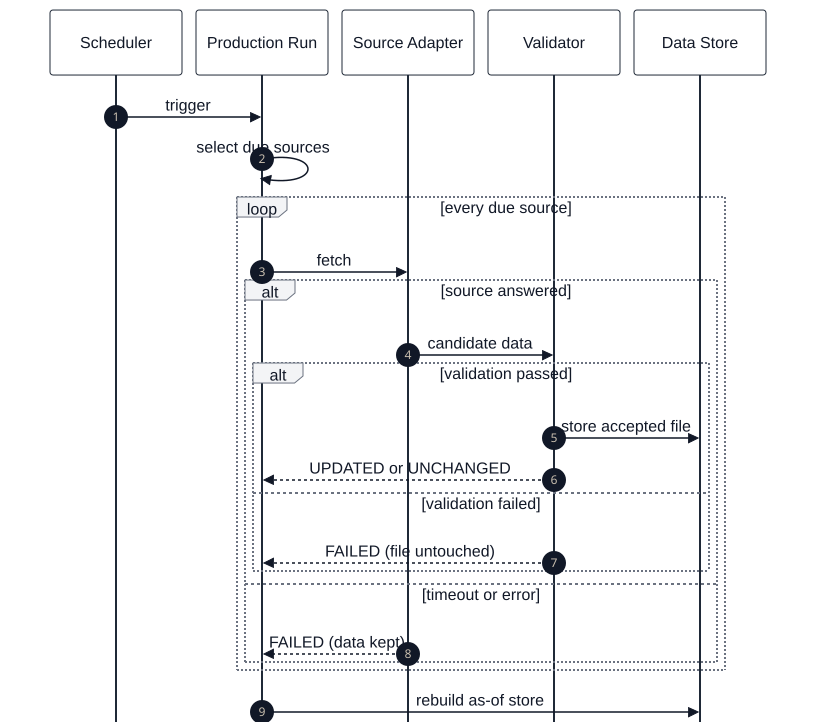

*Figure 7. Sequence diagram of a production run, part 1: trigger to store.*

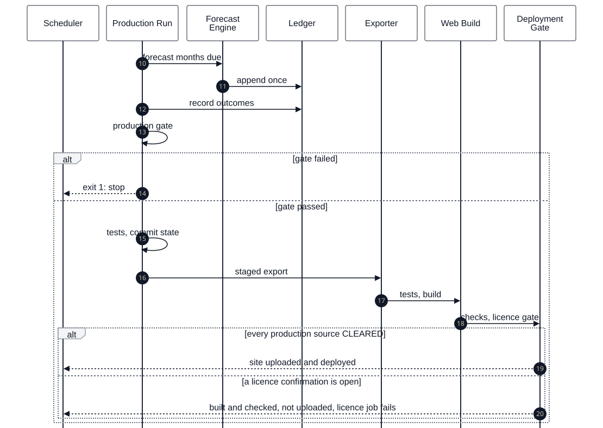

*Figure 8. Sequence diagram of a production run, part 2: forecast to deployment gate.*

### 12.8 The public user

Figure 9 shows a page request. The page reads `data/core.json` and the files of its own view; every figure on a page carries its source and date, and when a file is missing or a source is not healthy the page says what is unavailable and invents no value. The host answers a deep link with a copy of the application shell, so that a reload of any route works on a static host.

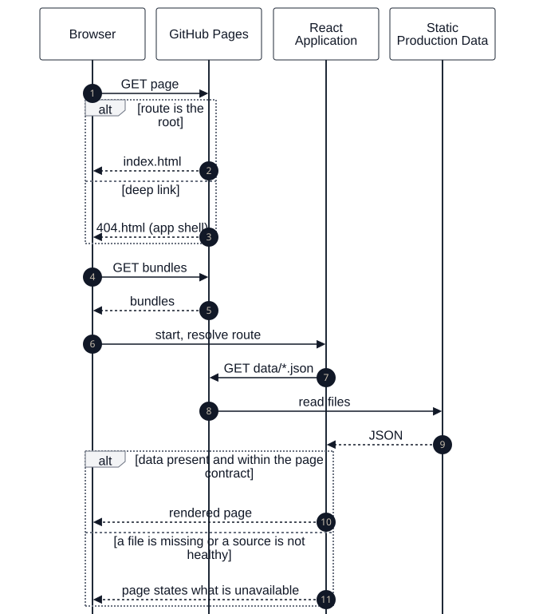

*Figure 9. Sequence diagram of a page request by a public user.*

### 12.9 Forecast data flow

Figure 10 follows one forecast from raw observations to the page. Raw observations are every release of the index. The as-of dataset holds the values as known on the issuance date, which is the first release of the previous month. The features are those of version F1; the official forecaster, the seasonal baseline BL-SEA, uses the month of the year and the past directions only. Its three probabilities give the class with the highest probability, which is appended to the hash-chained ledger and shown as the outlook, with its record and replay. The outcome is computed from later releases with the flat band of 0.5 per cent, once as first released and once final. The outcome joins the ledger entry later and never changes it.

 

*Figure 10. Forecast data flow. Upper row: from raw observations to probabilities. Lower row: from probabilities to the public presentation, with the outcome that later scores the ledger entry.*

### 12.10 Data model

Figures 11 to 13 show the tables of the derived store with the fields of `src/database/schema.sql`: the inputs (Figures 11 and 12) and the forecasts with their evaluation (Figure 13). Figures 14 and 15 show the operational records, which are JSON lines files with a hash chain, and the export. Field lists of the records are abridged to the fields that identify, date and chain an entry; the production run appears in Figure 15 by its key only, since Figure 14 gives its fields in full.


*Figure 11. Data model of the store: source files, series and observations. An observation is one row of the revision log, keyed by series, observation date and availability date.*


*Figure 12. Data model of the store: releases, labels and data-quality results of a series.*


*Figure 13. Data model of the store: forecast runs, model versions, forecasts and evaluation results.*


*Figure 14. Data model of the operational records: source declarations, ingestion records and production runs.*


*Figure 15. Data model of the operational records: ledger entries, outcomes and the export of a production run.*

### 12.11 Source status and deployment gating

Figure 16 gives the states of a source within one run and the states of a run on its way to deployment. A source that fails keeps its last valid data and is reported as DEGRADED while those data are within their age limit, and as STALE beyond it. A run reaches DEPLOYED only through every gate.

 

*Figure 16. State diagrams. Left: status of a source within one run. Right: a run from the production gate to deployment.*

### 12.12 Security

The system holds no credential and needs none: every source is public (NFR-008). The workflow uses the hosting provider's own token; write permission is given to the single step that commits the operational state, and the checkout keeps no credential. Only the provider's own actions are used. Retrieved content is parsed as data and never executed. Before any upload, every text file of the repository, the exported data and the built site is searched for secrets, private keys and addresses of a development machine (FR-025). The deployed site is static files; it has no form that reaches a server and stores nothing about a visitor (NFR-009). Details: `docs/SYSTEM_DESIGN.md`, section 15.

### 12.13 Licensing controls

Licence status is an input of the build. Each source carries one status with its evidence in `config/production_sources.yaml` (section 9.1). The policy check refuses a production source whose class is unknown or restricted (FR-021). The hosted repository is assembled by an allow-list and searched for anything of the retired access path (section 3.4). The licence gate at the end of the build lets the upload and the deployment run only if every production source is CLEARED (FR-025, NFR-010). At present every production source is CLEARED, the two fuel sources by the owner's decision and not by a confirmation of the publisher (section 9.4), so the gate is open. Details: `docs/DATA_AND_LICENSING.md`.

### 12.14 Reliability and failure handling

A failure may withhold new information; it never replaces valid data with invalid data and is never silent (FR-004, FR-019, NFR-006, NFR-016). A source that is late, unreachable or invalid keeps its last valid file and is reported with its reason. Each layer of a run is a separate process with a time limit. A run ends with exit code 0 (healthy), 2 (completed with a source not healthy; the site shows that state) or 1 (the gate failed; nothing new is published). No forecast is issued unless the release it depends on is on record, and none is estimated in its place. The scenarios are described one by one in `docs/OPERATIONS.md`, section 4.

## 13. Traceability

Figure 17 shows the chain along which every requirement is traced. The matrix in `docs/REQUIREMENTS_TRACEABILITY.md` holds one row per requirement of sections 7 and 8.


*Figure 17. Traceability chain.*

## 14. Verification Summary

The state verified for this version: 239 engine tests, of which 238 pass and 1 is skipped by design; 10 of 10 validators; 137 of 137 checks of the final audit; 47 of 47 tests of the application; a production build; a clean clone on Linux with all four workflows; a rehearsal of the hosted repository in five phases; deterministic reruns; a scan of the hosted repository and the built site for restricted sources and private material with no finding. What each of these proves and does not prove is the subject of `docs/VERIFICATION_AND_VALIDATION.md`.

## 15. Assumptions, Constraints and Dependencies

### 15.1 Constraints

*Table 13. Constraints.*

| Constraint | Effect on the system |
|---|---|
| No commercial data licence, no paid service, no credential | Only public sources read at their publishers; no rate data; static hosting on a free plan |
| A publisher's terms are read, never worked around | No automated collection where terms forbid it; a source of uncertain status is not deployed unless the owner records a decision to accept the open point, with its basis (section 9.4) |
| One maintainer, no operations staff | Unattended runs; state in the repository; no service to keep alive |
| The method is frozen | Target, classes, band, horizon, forecasters, evaluation and selection rule change only under a change record written first |
| The index is monthly, late and revised | One-step outlook; evaluation on values as known at each date; first-release and final outcomes kept apart |

### 15.2 Assumptions

*Table 14. Assumptions.*

| Assumption | Consequence if it fails |
|---|---|
| The Bureau continues to archive its releases in their present form | The adapter fails validation; the last valid data stay; the source is reported as failed |
| The publishers' sites remain reachable without a key | As above |
| A fuel value is available within eight days of its date | A comparison model could see a value slightly early; the official forecast does not use fuel |
| The hosting provider's free plan continues to offer scheduled workflows and static hosting for a public repository | The schedule or the site stops; nothing is lost, since the state is in the repository |
| The readings of the publishers' terms are correct | They are readings, not legal advice; the licence status of a source can be changed in one file, and the deployment gate follows it |

Software dependencies are pinned: Python 3.12 with the packages of `requirements.txt`; Node 22 with the lock file of the application.

## 16. Glossary

*Table 15. Terms.*

| Term | Meaning |
|---|---|
| As-of | The state of the data as it was published by a given date |
| Benchmark | The official index IC1312, for which the outlook is made |
| Final value | The value of a month after its three revisions |
| First release | The first publication of a month's value |
| Flat band | ±0.5 per cent of monthly change, inside which the direction is FLAT |
| Gate | A check that must pass before the next step may run |
| Issuance date | The day a forecast is made: the first release of the previous month |
| Ledger | The append-only record of issued forecasts |
| Official forecaster | The forecaster selected by rule and shown as the outlook |
| Outlook | The published forecast of the direction of the index |
| Vintage / release | One publication of the index by its publisher, with the values it made known |
| Walk-forward | Evaluation in which each forecast uses only data available before it |

## 17. References

1. U.S. Bureau of Labor Statistics. *U.S. Import and Export Price Indexes*, archived news releases. `https://www.bls.gov/bls/news-release/ximpim.htm`
2. U.S. Bureau of Labor Statistics. *Handbook of Methods: International Price Program* (revision of published indexes).
3. U.S. Energy Information Administration. *Petroleum and Other Liquids: Spot Prices*; *Copyrights and Reuse*. `https://www.eia.gov/about/copyrights_reuse.php`
4. Airport Authority Hong Kong. *Flight Information*, DATA.GOV.HK.
5. U.S. Department of Transportation. *International Report Departures*.
6. IEEE Std 830-1998, *Recommended Practice for Software Requirements Specifications*; ISO/IEC/IEEE 29148:2018, *Requirements engineering*. Used as a guide to structure.
7. Brier, G. W. (1950). Verification of forecasts expressed in terms of probability. *Monthly Weather Review* 78(1).
8. Research repository: `requirements/requirements.csv` (baseline); `execution/change_log.md` (change records CL-001 to CL-026); the validation protocols in `evaluation/`; `execution/LICENCE_REPAIR_REPORT.md`.
